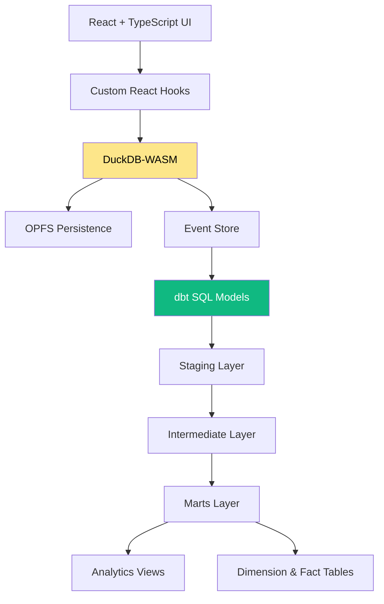
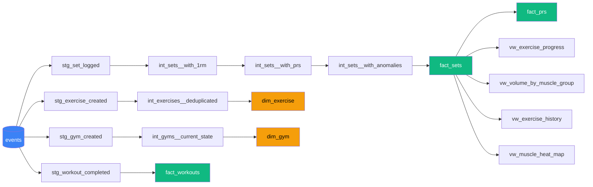

# Phase 11: CI/CD & Portfolio - Research

**Researched:** 2026-01-31
**Domain:** GitHub Actions CI/CD, GitHub Pages deployment, portfolio README, dbt docs, in-app observability
**Confidence:** HIGH

## Summary

This phase adds production-grade engineering practices to GymLog: automated CI/CD via GitHub Actions, deployment to GitHub Pages, a comprehensive portfolio README, dbt lineage visualization, and in-app observability/data quality displays. The project already has a solid test infrastructure (Vitest unit tests, Playwright E2E tests, dbt schema tests + custom tests) but no CI pipeline or deployment automation.

The primary challenge is deploying a DuckDB-WASM app to GitHub Pages, which requires SharedArrayBuffer via COOP/COEP headers. GitHub Pages does not support custom HTTP headers, so a service worker workaround (`coi-serviceworker`) is required. The dbt toolchain needs Python in CI for `dbt compile` and `dbt docs generate`, adding a second language runtime to the pipeline.

**Primary recommendation:** Build a multi-job GitHub Actions workflow (lint, unit test, E2E test, dbt compile, build+deploy) that gates deployment on all checks passing. Use `coi-serviceworker` for COOP/COEP on GitHub Pages. Generate dbt docs as a static page embedded in the deploy. Write the README with Mermaid diagrams (natively rendered by GitHub) for architecture and data lineage.

## Standard Stack

### Core

| Tool | Version | Purpose | Why Standard |
|------|---------|---------|--------------|
| GitHub Actions | N/A | CI/CD pipeline | Native to GitHub, free for public repos |
| `actions/checkout@v5` | v5 | Checkout code | Official GitHub action |
| `actions/setup-node@v6` | v6 | Node.js setup | Official, supports caching |
| `actions/setup-python@v5` | v5 | Python for dbt | Official, needed for dbt-duckdb |
| `actions/configure-pages@v5` | v5 | GitHub Pages config | Official Pages action |
| `actions/upload-pages-artifact@v4` | v4 | Upload dist to Pages | Official Pages action |
| `actions/deploy-pages@v4` | v4 | Deploy to Pages | Official Pages action |
| `coi-serviceworker` | latest | COOP/COEP headers on GitHub Pages | Only viable solution for SharedArrayBuffer on static hosts |
| `dbt-core` + `dbt-duckdb` | 1.8+ / 1.9+ | dbt compile and docs in CI | Official dbt adapter for DuckDB |

### Supporting

| Tool | Purpose | When to Use |
|------|---------|-------------|
| Mermaid | Architecture/lineage diagrams in README | GitHub renders Mermaid natively in markdown |
| `dbt docs generate --static` | Self-contained dbt docs HTML | Embed in deploy or link from README |
| `navigator.storage.estimate()` | OPFS storage usage monitoring | In-app observability dashboard |
| `performance.now()` | DuckDB query timing | In-app observability dashboard |

### Alternatives Considered

| Instead of | Could Use | Tradeoff |
|------------|-----------|----------|
| coi-serviceworker | Cloudflare Pages (custom headers) | Different hosting, more complex setup |
| Mermaid in README | diagrams.net/DrawIO PNG | Mermaid is text-based, version-controllable, GitHub-native |
| dbt docs static | Separate dbt docs hosted site | Extra deployment complexity for a portfolio project |
| In-app observability | External monitoring (Sentry, etc.) | Overkill for client-only PWA; in-app is self-contained |

## Architecture Patterns

### CI/CD Pipeline Structure

```
Push to main
    |
    v
+------------------+
| Job: lint        |  npm run lint
+------------------+
    |
    v
+------------------+
| Job: test-unit   |  npm run test (vitest)
+------------------+
    |
    v
+------------------+
| Job: test-e2e    |  npx playwright test
+------------------+     (needs playwright install --with-deps)
    |                    (needs SharedArrayBuffer via browser args)
    v
+------------------+
| Job: dbt-check   |  pip install dbt-duckdb
+------------------+     dbt compile --target browser
    |                    dbt test (schema + custom tests)
    v
+------------------+
| Job: build-deploy|  npm run build
+------------------+     dbt docs generate --static
    |                    copy coi-serviceworker.js to dist/
    |                    upload + deploy to GitHub Pages
    v
 GitHub Pages live
```

### Pattern 1: Multi-Job Workflow with Dependencies

**What:** Each CI step is a separate job with `needs:` dependencies so failures are isolated and clear.
**When to use:** When you want parallel execution where possible and clear failure attribution.
**Example:**

```yaml
name: CI/CD

on:
  push:
    branches: ['main']
  pull_request:
    branches: ['main']

permissions:
  contents: read
  pages: write
  id-token: write

concurrency:
  group: 'pages'
  cancel-in-progress: true

jobs:
  lint:
    runs-on: ubuntu-latest
    steps:
      - uses: actions/checkout@v5
      - uses: actions/setup-node@v6
        with:
          node-version: lts/*
          cache: 'npm'
      - run: npm ci
      - run: npm run lint

  test-unit:
    runs-on: ubuntu-latest
    steps:
      - uses: actions/checkout@v5
      - uses: actions/setup-node@v6
        with:
          node-version: lts/*
          cache: 'npm'
      - run: npm ci
      - run: npm run test

  test-e2e:
    runs-on: ubuntu-latest
    steps:
      - uses: actions/checkout@v5
      - uses: actions/setup-node@v6
        with:
          node-version: lts/*
          cache: 'npm'
      - run: npm ci
      - run: npx playwright install --with-deps chromium
      - run: npx playwright test
      - uses: actions/upload-artifact@v4
        if: ${{ !cancelled() }}
        with:
          name: playwright-report
          path: playwright-report/
          retention-days: 7

  dbt-check:
    runs-on: ubuntu-latest
    steps:
      - uses: actions/checkout@v5
      - uses: actions/setup-python@v5
        with:
          python-version: '3.11'
      - run: pip install dbt-duckdb
      - run: cd dbt && dbt compile --target browser
      - run: cd dbt && dbt test --target browser

  build-deploy:
    needs: [lint, test-unit, test-e2e, dbt-check]
    if: github.ref == 'refs/heads/main' && github.event_name == 'push'
    runs-on: ubuntu-latest
    environment:
      name: github-pages
      url: ${{ steps.deployment.outputs.page_url }}
    steps:
      - uses: actions/checkout@v5
      - uses: actions/setup-node@v6
        with:
          node-version: lts/*
          cache: 'npm'
      - uses: actions/setup-python@v5
        with:
          python-version: '3.11'
      - run: npm ci
      - run: npm run build
      - run: pip install dbt-duckdb
      - run: cd dbt && dbt docs generate --static --target browser
      - run: cp dbt/target/index.html dist/dbt-docs.html
      - run: cp node_modules/coi-serviceworker/coi-serviceworker.js dist/ || cp public/coi-serviceworker.js dist/
      - uses: actions/configure-pages@v5
      - uses: actions/upload-pages-artifact@v4
        with:
          path: './dist'
      - id: deployment
        uses: actions/deploy-pages@v4
```

### Pattern 2: coi-serviceworker Integration

**What:** A service worker that intercepts fetch requests and adds COOP/COEP headers, enabling SharedArrayBuffer on static hosts like GitHub Pages.
**When to use:** When deploying DuckDB-WASM (or any SharedArrayBuffer-dependent app) to GitHub Pages.
**Setup:**

```html
<!-- index.html - add BEFORE any other scripts -->
<script src="coi-serviceworker.js"></script>
```

**Important caveats:**
- The file must be served from your own origin (not a CDN)
- It must be a separate file (cannot be bundled)
- On first visit, it registers the service worker and reloads the page
- Place in `/public/` so Vite copies it to `dist/` during build
- Must also be in the root of `dist/` for the service worker scope to work

### Pattern 3: Vite Base Path for GitHub Pages

**What:** Configure Vite's `base` to match the GitHub Pages subpath.
**When to use:** When deploying to `https://username.github.io/repo-name/`.

```typescript
// vite.config.ts
export default defineConfig({
  base: process.env.GITHUB_PAGES ? '/repo-name/' : '/',
  // ... rest of config
})
```

Or dynamically via environment variable in CI:
```yaml
- name: Build
  run: npm run build
  env:
    VITE_BASE: '/${{ github.event.repository.name }}/'
```

### Pattern 4: In-App Observability Hook

**What:** A React hook that queries DuckDB and browser APIs for observability metrics.
**When to use:** For the Settings > Observability dashboard.

```typescript
// src/hooks/useObservability.ts
interface ObservabilityMetrics {
  storageUsageBytes: number;
  storageQuotaBytes: number;
  storageUsagePct: number;
  eventCount: number;
  avgQueryTimeMs: number;
  recentQueries: { sql: string; durationMs: number; timestamp: Date }[];
}

async function getStorageUsage(): Promise<{ usage: number; quota: number }> {
  if (navigator.storage && navigator.storage.estimate) {
    const estimate = await navigator.storage.estimate();
    return {
      usage: estimate.usage ?? 0,
      quota: estimate.quota ?? 0,
    };
  }
  return { usage: 0, quota: 0 };
}
```

### Pattern 5: Data Quality Display from dbt Tests

**What:** Pre-compute dbt test results at build time and display in app, OR run the compiled test SQL client-side.
**When to use:** For the data quality summary in the app.

**Option A - Run compiled test SQL client-side (RECOMMENDED):**
dbt tests are just SQL queries that return rows for failures. The compiled SQL is already in `dbt/target/compiled/gymlog/tests/`. Import these as strings and run them in DuckDB-WASM at runtime.

```typescript
// Run dbt test SQL in browser
const testResults = await Promise.all(
  DQT_TESTS.map(async (test) => {
    const conn = await db.connect();
    const result = await conn.query(test.sql);
    const failureCount = result.numRows;
    await conn.close();
    return {
      name: test.name,
      status: failureCount === 0 ? 'pass' : 'fail',
      failureCount,
    };
  })
);
```

**Option B - Pre-compute at build time:**
Run `dbt test` in CI, capture `run_results.json`, embed results as JSON in the build. Downside: results are stale (from build time, not runtime data).

**Recommendation:** Option A is better for a portfolio project because it demonstrates running data quality checks on live user data in the browser.

### Anti-Patterns to Avoid

- **Single monolithic CI job:** Separating into jobs gives faster feedback on which step failed
- **Deploying without test gates:** Always use `needs:` to depend on test jobs passing
- **Bundling coi-serviceworker:** It must be a standalone file; Vite bundling breaks it
- **Hard-coding base path:** Use environment variables so local dev and CI work the same
- **Running dbt test on empty database in CI:** dbt tests need data; use `dbt compile` for CI validation and save runtime test execution for client-side

## Don't Hand-Roll

| Problem | Don't Build | Use Instead | Why |
|---------|-------------|-------------|-----|
| COOP/COEP on static hosting | Custom service worker for headers | `coi-serviceworker` | Edge cases with registration, reload, scope |
| CI/CD pipeline | Shell scripts | GitHub Actions YAML | Standard, managed, artifact handling |
| Deployment to Pages | Manual FTP/SCP | `actions/deploy-pages@v4` | Handles tokens, environments, rollback |
| Architecture diagrams | Image files | Mermaid in markdown | Text-based, version-controllable, GitHub renders natively |
| dbt lineage visualization | Custom graph rendering | `dbt docs generate --static` | Single HTML file with interactive DAG |
| Storage usage monitoring | Custom OPFS file listing | `navigator.storage.estimate()` | Browser API, returns usage/quota in bytes |

## Common Pitfalls

### Pitfall 1: SharedArrayBuffer on GitHub Pages
**What goes wrong:** DuckDB-WASM requires SharedArrayBuffer, which requires COOP/COEP headers. GitHub Pages does not allow custom headers. App loads but DuckDB fails silently or crashes.
**Why it happens:** GitHub Pages is a static host with no header customization.
**How to avoid:** Include `coi-serviceworker.js` in `public/` directory. Add `<script src="coi-serviceworker.js"></script>` before other scripts in `index.html`. The service worker intercepts requests and adds the required headers.
**Warning signs:** "SharedArrayBuffer is not defined" errors in console. Page works locally but not on GitHub Pages.

### Pitfall 2: Vite Base Path Mismatch
**What goes wrong:** Assets (JS, CSS, images) return 404 on GitHub Pages because paths are absolute (`/assets/...`) instead of relative to the repo subpath (`/repo-name/assets/...`).
**Why it happens:** Vite defaults to `base: '/'` but GitHub Pages serves from `/<repo-name>/`.
**How to avoid:** Set `base` in `vite.config.ts` conditionally for production builds. Use an environment variable or hard-code the repo name.
**Warning signs:** Blank page on GitHub Pages with 404s in network tab for JS/CSS files.

### Pitfall 3: Playwright in CI Needs Browser Install
**What goes wrong:** Playwright tests fail with "browser not found" errors.
**Why it happens:** CI runners don't have Playwright browsers pre-installed.
**How to avoid:** Run `npx playwright install --with-deps chromium` before tests. Only install chromium (the project only tests chromium). The `--with-deps` flag installs OS-level dependencies.
**Warning signs:** "Executable doesn't exist" errors in CI logs.

### Pitfall 4: dbt compile Needs Python in CI
**What goes wrong:** dbt commands fail because Python and dbt-duckdb are not available.
**Why it happens:** The CI runner has Node.js but not Python/dbt by default.
**How to avoid:** Use `actions/setup-python@v5` and `pip install dbt-duckdb` in the dbt-check job. The dbt-duckdb adapter includes dbt-core as a dependency.
**Warning signs:** "dbt: command not found" in CI logs.

### Pitfall 5: dbt test on Empty Database
**What goes wrong:** dbt test passes vacuously because there is no data in the CI in-memory database.
**Why it happens:** dbt compiles against `:memory:` DuckDB with no events table populated.
**How to avoid:** Use `dbt compile` in CI to validate SQL syntax and model DAG. Use `dbt test` only with seeded data or run compiled test SQL client-side. For CI, `dbt compile` + `dbt parse` are sufficient to catch model errors.
**Warning signs:** dbt test returns 0 failures but didn't actually test anything.

### Pitfall 6: coi-serviceworker Double Reload
**What goes wrong:** First visit to the app causes a visible page reload as the service worker registers.
**Why it happens:** The service worker must be registered before it can intercept requests and add headers.
**How to avoid:** This is expected behavior and cannot be eliminated. Minimize by ensuring the service worker script loads first. Consider a loading screen that masks the reload. Document this in README.
**Warning signs:** Users see a flash/reload on first visit only.

## Code Examples

### GitHub Actions Workflow (Complete)

See "Pattern 1" above for the full workflow YAML. Key points:
- Source: [Vite Static Deploy Docs](https://vite.dev/guide/static-deploy)
- Source: [Playwright CI Intro](https://playwright.dev/docs/ci-intro)

### coi-serviceworker Setup

```bash
# Install
npm install coi-serviceworker

# Copy to public/ so Vite includes it in dist/
cp node_modules/coi-serviceworker/coi-serviceworker.js public/
```

```html
<!-- index.html - FIRST script in <head> -->
<script src="coi-serviceworker.js"></script>
```

Source: [coi-serviceworker GitHub](https://github.com/gzuidhof/coi-serviceworker)

### Storage Usage API

```typescript
// Source: MDN StorageManager.estimate()
async function getStorageMetrics() {
  if (!navigator.storage?.estimate) {
    return { usage: 0, quota: 0, percent: 0 };
  }
  const { usage = 0, quota = 0 } = await navigator.storage.estimate();
  return {
    usage,
    quota,
    percent: quota > 0 ? (usage / quota) * 100 : 0,
  };
}
```

Source: [MDN StorageManager.estimate()](https://developer.mozilla.org/en-US/docs/Web/API/StorageManager/estimate)

### DuckDB Query Timing Wrapper

```typescript
async function timedQuery(db: AsyncDuckDB, sql: string): Promise<{ result: any; durationMs: number }> {
  const start = performance.now();
  const conn = await db.connect();
  const result = await conn.query(sql);
  await conn.close();
  const durationMs = performance.now() - start;
  return { result, durationMs };
}
```

### Event Count Query

```typescript
// Simple event count from the events table
const EVENT_COUNT_SQL = `SELECT COUNT(*) as cnt FROM events`;
const EVENT_COUNTS_BY_TYPE_SQL = `SELECT event_type, COUNT(*) as cnt FROM events GROUP BY event_type ORDER BY cnt DESC`;
```

### dbt Docs Generation in CI

```bash
# In CI, after pip install dbt-duckdb:
cd dbt
dbt docs generate --static --target browser
# Output: dbt/target/index.html (self-contained, ~2-5MB)
# Copy to dist for deployment:
cp target/index.html ../dist/dbt-docs.html
```

### README Mermaid Architecture Diagram

```markdown
## Architecture


```

### README Mermaid dbt Lineage Diagram

```markdown
## Data Lineage


```

### Portfolio README Structure

```markdown
# GymLog - Event-Sourced Workout Tracker

> Browser-native workout tracking with analytical SQL transformations powered by DuckDB-WASM and dbt

[Live Demo](https://username.github.io/gymlog) | [dbt Docs](https://username.github.io/gymlog/dbt-docs.html)

## Why This Project

[2-3 sentences on the data engineering challenge this solves]

## Architecture

[Mermaid diagram]

### Key Data Engineering Decisions

1. **Event Sourcing** - [why and tradeoffs]
2. **DuckDB-WASM** - [why browser-native OLAP]
3. **dbt for Transformations** - [why SQL-based transformation layer]
4. **OPFS Persistence** - [why Origin Private File System]

## Data Model & Lineage

[Mermaid lineage diagram]

### Transformation Layers
- **Staging:** Extract typed fields from raw JSON events
- **Intermediate:** Business logic (deduplication, 1RM calculation, PR detection, anomaly detection)
- **Marts:** Star schema (dimensions + facts) and analytical views

## Data Quality

- Schema tests: unique, not_null on all key columns
- Custom tests: weight positivity, rep range validation
- Anomaly detection: 50%+ weight changes flagged automatically

## Tech Stack

| Layer | Technology | Purpose |
|-------|-----------|---------|
| Frontend | React 19 + TypeScript | UI components |
| Styling | Tailwind CSS 4 | Utility-first CSS |
| State | Zustand | Client state management |
| Database | DuckDB-WASM 1.32 | In-browser OLAP engine |
| Transforms | dbt + dbt-duckdb | SQL transformation layer |
| Storage | OPFS | Persistent browser storage |
| Charts | Recharts | Data visualization |
| Testing | Vitest + Playwright | Unit + E2E testing |
| CI/CD | GitHub Actions | Automated pipeline |
| Hosting | GitHub Pages | Static deployment |

## CI/CD Pipeline

[Brief description of pipeline stages]

## Getting Started

[npm install, npm run dev, etc.]

## Running Tests

[npm test, npm run test:e2e, etc.]
```

## State of the Art

| Old Approach | Current Approach | When Changed | Impact |
|--------------|------------------|--------------|--------|
| `peaceiris/actions-gh-pages` (gh-pages branch) | `actions/deploy-pages@v4` (direct Pages API) | 2023 | No need for gh-pages branch, uses Pages environment |
| Manual dbt docs hosting | `dbt docs generate --static` | dbt 1.7+ | Single self-contained HTML file |
| Image-based architecture diagrams | Mermaid in GitHub markdown | 2022+ | Version-controllable, no external tools needed |
| PNG/SVG lineage diagrams | GitHub-rendered Mermaid | 2022+ | Auto-updated with code changes |

## Open Questions

1. **Exact repo name for base path**
   - What we know: Vite needs `base: '/<repo-name>/'` for GitHub Pages
   - What's unclear: The actual GitHub repository name (currently `gymlog-temp`)
   - Recommendation: Use an environment variable or detect from `github.event.repository.name` in CI

2. **dbt Python version pinning**
   - What we know: dbt-duckdb works with Python 3.9-3.12
   - What's unclear: Whether the latest dbt-duckdb has breaking changes with Python 3.13
   - Recommendation: Pin to Python 3.11 in CI for stability

3. **coi-serviceworker first-load experience**
   - What we know: First visit causes a visible reload
   - What's unclear: Whether this creates a poor first impression for portfolio reviewers
   - Recommendation: Add a minimal loading screen that masks the reload

4. **dbt test execution strategy for data quality display**
   - What we know: Compiled test SQL can run client-side in DuckDB-WASM
   - What's unclear: Performance impact of running all tests on page load
   - Recommendation: Run tests on-demand (user clicks "Run Data Quality Check" in Settings) rather than automatically

## Sources

### Primary (HIGH confidence)
- [Vite Static Deploy Documentation](https://vite.dev/guide/static-deploy) - Complete GitHub Actions workflow
- [Playwright CI Introduction](https://playwright.dev/docs/ci-intro) - CI setup guide
- [MDN StorageManager.estimate()](https://developer.mozilla.org/en-US/docs/Web/API/StorageManager/estimate) - Storage usage API
- [MDN OPFS Documentation](https://developer.mozilla.org/en-US/docs/Web/API/File_System_API/Origin_private_file_system) - OPFS behavior
- [dbt docs command reference](https://docs.getdbt.com/reference/commands/cmd-docs) - `--static` flag documentation
- [coi-serviceworker](https://github.com/gzuidhof/coi-serviceworker) - COOP/COEP service worker
- [dbt-duckdb adapter](https://github.com/duckdb/dbt-duckdb) - dbt adapter for DuckDB

### Secondary (MEDIUM confidence)
- [Thomas Steiner blog - COOP/COEP on static hosting (March 2025)](https://blog.tomayac.com/2025/03/08/setting-coop-coep-headers-on-static-hosting-like-github-pages/) - Verified workaround approach
- [Wasmer docs - COOP/COEP patching](https://docs.wasmer.io/sdk/wasmer-js/how-to/coop-coep-headers) - Additional confirmation of service worker approach
- [Data Engineering Project Template](https://github.com/data-engineering-community/data-engineering-project-template) - README best practices

### Tertiary (LOW confidence)
- [GitHub Community Discussion #13309](https://github.com/orgs/community/discussions/13309) - GitHub Pages header limitations (community, no official resolution)

## Metadata

**Confidence breakdown:**
- CI/CD pipeline: HIGH - official Vite docs + GitHub Actions docs provide exact workflow
- GitHub Pages deployment: HIGH - well-documented, only caveat is COOP/COEP workaround
- COOP/COEP workaround: HIGH - coi-serviceworker is widely used, verified by multiple sources
- dbt in CI: HIGH - dbt-duckdb with `:memory:` is explicitly designed for CI use
- README/portfolio: MEDIUM - best practices are subjective but community template is solid
- In-app observability: HIGH - `navigator.storage.estimate()` is standard Web API
- Data quality display: MEDIUM - client-side test execution is feasible but performance untested

**Existing project infrastructure:**
- Vitest config: `/home/dev/workspace/vitest.config.ts` (happy-dom, coverage with v8)
- Playwright config: `/home/dev/workspace/playwright.config.ts` (chromium only, SharedArrayBuffer args, CI-aware retries/workers)
- Unit tests: 7 test files in `src/`
- E2E tests: 1 spec file in `src/e2e/workout-flow.spec.ts`
- dbt tests: 2 custom tests + schema tests (unique, not_null) on all key columns
- dbt compiled output: `dbt/target/compiled/` with all models
- dbt docs artifacts: `dbt/target/index.html`, `manifest.json`, `catalog.json` already exist
- No Python config files (Pipfile, pyproject.toml, requirements.txt) - dbt was likely installed ad-hoc
- README: Default Vite template boilerplate, needs complete rewrite
- No `.github/workflows/` directory exists yet

**Research date:** 2026-01-31
**Valid until:** 2026-03-01 (GitHub Actions and dbt ecosystem are stable)
