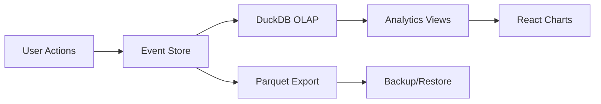

# Feature Landscape: v1.2 UX & Portfolio Polish

**Domain:** Fitness/Workout Tracking PWA (Local-First)
**Milestone:** v1.2 - UX & Portfolio Polish
**Researched:** 2026-01-30
**Confidence:** HIGH

## Executive Summary

This research covers six new feature categories for the v1.2 milestone:
1. **Batch set logging** - Grid-based entry with ghost data from previous sessions
2. **Workout rotation/program scheduling** - Auto-advancing template sequences (Upper/Lower/PPL splits)
3. **Workout completion summaries** - Post-workout metrics and achievements
4. **Demo/seed data** - Realistic onboarding data for portfolio showcase
5. **Observability dashboards** - Local-first analytics for browser-based data apps
6. **Portfolio README** - Data engineering best practices for technical documentation

All findings are based on current (2026) industry standards from leading workout apps (Hevy, Strong, StrengthLog, Setgraph) and modern web development practices.

---

## 1. Batch Set Logging

### Table Stakes

Features users expect in modern workout apps when logging multiple sets.

| Feature | Why Expected | Complexity | Notes |
|---------|--------------|------------|-------|
| **Grid/table view of all sets** | Standard UX in Hevy, Strong, StrengthLog - users expect to see all sets at once, not one-at-a-time | Medium | Replace sequential logging with spreadsheet-like grid |
| **Pre-filled template data** | Apps auto-fill target sets/reps from workout template | Low | Already have templates, just need to populate grid on workout start |
| **Ghost data from last session** | Hevy shows "PREVIOUS" column, Strong pre-fills last weight/reps - critical for progressive overload | Medium | Query last workout for same exercise+gym, display as placeholder text |
| **In-cell editing** | Click-to-edit each cell without opening forms - Simple Table (2026) recommends in-cell for bulk edits | High | Need spreadsheet-like interaction, React libraries available |
| **Save all sets at once** | Batch save vs save-per-set - reduces taps, modern standard | Low | Current "Log Set" becomes "Save Workout" |
| **Keyboard navigation** | Tab between cells, Enter to next row - expected in grid UIs | Medium | Simple Table and AG Grid provide this OOTB |
| **Copy/paste from Excel** | Power users expect clipboard integration for bulk data entry | Medium | Libraries like Simple Table support Excel/Sheets paste |

### Differentiators

Features that set products apart in the batch logging space.

| Feature | Value Proposition | Complexity | Notes |
|---------|-------------------|------------|-------|
| **Per-set ghost data toggle** | Hevy lets users choose: last session for this exercise OR last session for this routine+exercise | Medium | Settings: global vs routine-scoped history |
| **Visual diff indicators** | Show which sets improved vs last session (green/red highlights) | Low | Already have PR detection, extend to show +5lbs or +2 reps |
| **Bulk edit actions** | Select multiple cells, apply same weight or increment all by X% | High | Advanced but powerful for linear progression programs |
| **RIR pre-fill from RPE zones** | If user logged @RPE 8 last time, suggest RIR 2 this time | Medium | Smart defaults based on workout history |
| **Set type indicators** | Mark sets as warmup, working, drop, failure in grid | Low | Extend existing set metadata, add column or cell badge |
| **Swipe gestures for mobile** | Setgraph logs sets in <3 seconds with swipe-to-confirm | High | Mobile-first interaction, may conflict with grid UI |

### Anti-Features

Features to explicitly NOT build. Common mistakes in batch logging UX.

| Anti-Feature | Why Avoid | What to Do Instead |
|--------------|-----------|-------------------|
| **Infinite scrolling grids** | Performance death with event-sourced data, DOM bloat | Virtualized rows (AG Grid, Simple Table support) |
| **Auto-save on every cell change** | Generates too many events, conflicts with immutable event log | Save on "Complete Workout" or explicit "Save Progress" |
| **Complex form validation in-grid** | Slows down fast logging, users just want to enter numbers | Validate on save, allow temporary invalid states |
| **Mandatory fields for all sets** | Forcing RIR/RPE/notes on every set is tedious | Make optional, only require weight/reps |
| **Overwriting ghost data on focus** | Some apps clear placeholder when you click - annoying if you wanted to keep it | Keep ghost data until user types, allow quick accept with Enter |

### Feature Dependencies

```
Existing → New
Templates → Grid pre-fill (need template structure)
Exercise history → Ghost data (need last session query)
PR detection → Visual diff (extend existing logic)
Event sourcing → Batch save (must create multiple events atomically)
Gym context → History scoping (ghost data must respect gym filter)
```

### Implementation Notes

**React Grid Libraries (2026):**
- **Simple Table** - Recommended for type-specific editors, built-in Excel paste, keyboard nav
- **AG Grid** - Enterprise-grade, batch editing support, may be overkill
- **Syncfusion React Grid** - Batch edit mode, but proprietary license
- **ReactGrid** - Lightweight spreadsheet component

**Recommended:** Simple Table or ReactGrid for local-first PWA, avoid heavy enterprise grids.

---

## 2. Workout Rotation / Program Scheduling

### Table Stakes

Standard features in apps supporting structured programs (PPL, Upper/Lower splits).

| Feature | Why Expected | Complexity | Notes |
|---------|--------------|------------|-------|
| **Define template sequence** | Users need to specify: Upper A → Lower A → Upper B → Lower B | Low | Settings page: ordered list of templates |
| **Auto-advance to next** | After completing workout, app suggests next in rotation | Low | On workout completion, increment position in sequence |
| **Default gym per rotation** | Rotation tied to specific gym (Home gym = PPL, Commercial gym = Bro split) | Low | Store gym_id + template_sequence in settings |
| **Manual override** | User can skip ahead or go back in sequence | Low | "Next workout" picker shows rotation default + full template list |
| **Rotation reset** | Start sequence over from beginning | Low | Button to reset position to index 0 |

### Differentiators

Features that go beyond basic rotation.

| Feature | Value Proposition | Complexity | Notes |
|---------|-------------------|------------|-------|
| **Multi-gym rotations** | Different rotation for each gym (travel, home, office) | Medium | Store rotations keyed by gym_id, switch on gym select |
| **Calendar view** | Show next 2 weeks of planned workouts in rotation | Medium | Generate calendar from rotation + workout history |
| **Rest day logic** | PPLUL = Mon-Fri (5 days on, 2 off), Upper/Lower = 4 days with floating rest | High | Define rotation cadence: daily, every-other-day, custom schedule |
| **Deload weeks** | Every 4th week, rotation switches to deload templates | High | Rotation phases with week counters |
| **Volume-based auto-regulation** | If plateau detected in analytics, suggest deload or skip to next phase | High | Integrate with existing SQL plateau detection |

### Anti-Features

What NOT to build for workout rotations.

| Anti-Feature | Why Avoid | What to Do Instead |
|--------------|-----------|-------------------|
| **Complex periodization** | Linear/undulating/block periodization is overkill for v1.2 | Simple sequence rotation, defer to future milestone |
| **AI workout generation** | "Smart" rotations that change based on recovery/performance add complexity | User-defined sequences, predictable patterns |
| **Mandatory rotations** | Forcing users into rotation mode breaks flexibility | Rotation is optional setting, one-off workouts still work |
| **Calendar sync integrations** | Google Calendar, Apple Calendar adds API complexity | Show in-app calendar only |

### Feature Dependencies

```
Existing → New
Templates → Rotation definition (need templates to sequence)
Gym management → Multi-gym rotations (rotation per gym)
Workout history → Auto-advance (track last completed workout)
Settings → Rotation config (store sequence + position)
```

### Implementation Notes

**Standard Rotation Patterns (2026):**
- **PPLUL** (Push/Pull/Legs/Upper/Lower) - 5 days, Mon-Fri, weekends off
- **Upper/Lower** - 4 days (Mon/Tue/Thu/Fri), Wed/Sat/Sun rest
- **PPL** (Push/Pull/Legs) - 6 days, 1 rest day
- **Arnold Split** - 6 days (Chest+Back, Shoulders+Arms, Legs), 1 rest

**Data Model:**
```typescript
interface WorkoutRotation {
  id: string;
  gym_id: string;
  name: string; // "Home PPL", "Commercial Upper/Lower"
  template_sequence: string[]; // [template_id_1, template_id_2, ...]
  current_position: number; // index in sequence
  created_at: timestamp;
}
```

---

## 3. Workout Completion Summaries

### Table Stakes

Post-workout metrics shown in Hevy, StrengthLog, FitNotes.

| Feature | Why Expected | Complexity | Notes |
|---------|--------------|------------|-------|
| **Total volume lifted** | Sum of (weight × reps) for all sets - fundamental metric | Low | Already calculate for analytics, show on summary screen |
| **Workout duration** | Time from first set to last set | Low | Track workout start/end timestamps |
| **Sets completed** | Total sets logged this session | Low | Count events |
| **Exercises completed** | Number of distinct exercises | Low | Count unique exercise_ids |
| **Personal records** | List new PRs achieved (1RM, weight at rep, volume) | Low | Already have PR detection, collect and display |
| **Comparison to last session** | "5% more volume than last Upper A workout" | Medium | Query last workout with same template, calculate delta |

### Differentiators

Advanced summary features.

| Feature | Value Proposition | Complexity | Notes |
|---------|-------------------|------------|-------|
| **Muscle group breakdown** | "Chest: 12 sets, Back: 10 sets, Shoulders: 8 sets" with pie chart | Medium | Already have muscle mapping for heat map, aggregate by workout |
| **Heart rate zone time** | If synced with wearable, show time in each HR zone | High | Not in scope for local-first PWA without integrations |
| **Training effect score** | Garmin/COROS-style metric for workout intensity | High | Requires physiological modeling, defer |
| **Session RPE** | Overall difficulty 1-10 after workout | Low | Add post-workout prompt for subjective rating |
| **Share to social** | Export workout summary as image for Instagram/Twitter | Medium | Generate PNG from summary data, portfolio differentiator |
| **Streak tracking** | "5 workouts this week", "12-day streak" | Low | Count workouts in last 7/30 days from event log |

### Anti-Features

What not to include in summaries.

| Anti-Feature | Why Avoid | What to Do Instead |
|--------------|-----------|-------------------|
| **Excessive metrics** | Showing 20+ stats is overwhelming | Focus on 5-7 key metrics (volume, duration, PRs, comparison) |
| **Auto-post to social** | Privacy concern, annoying for users | Manual share only, never automatic |
| **Workout scoring/grades** | "B+ workout" feels arbitrary and discouraging | Show objective metrics, let user interpret |
| **Ads or upsells** | Post-workout is celebratory moment, don't ruin with monetization | Clean summary screen, no interruptions |

### Feature Dependencies

```
Existing → New
PR detection → PR list in summary
Volume analytics → Total volume calculation
Muscle mapping → Muscle group breakdown
Workout events → Duration, sets, exercises counts
Template history → Last session comparison
```

### Implementation Notes

**Summary Screen Flow:**
1. User completes last set in workout
2. "Complete Workout" button → triggers batch save
3. Navigate to summary screen with loading state
4. Calculate metrics from newly saved events
5. Show celebration screen with confetti/animation
6. Display metrics with visual hierarchy (volume largest, PRs highlighted)
7. Optional: prompt for session RPE (1-10 scale)
8. "Done" button returns to home

**StrengthLog Monthly Report Structure (2026):**
- Completed workouts
- Time spent training
- Total sets
- Total volume
- Volume per muscle group (pie chart)
- Personal records list
- Most-logged exercises

**Recommended for v1.2:** Per-workout summary (not monthly), focus on immediate feedback.

---

## 4. Demo/Seed Data Patterns

### Table Stakes

What portfolio apps need for first-time user experience.

| Feature | Why Expected | Complexity | Notes |
|---------|--------------|------------|-------|
| **Realistic exercise names** | "Bench Press", "Squat", not "Exercise 1" | Low | Use Faker.js or manual curated list |
| **Complete workout history** | 4-6 weeks of past workouts to populate analytics | Medium | Generate events, respect event sourcing format |
| **Progressive overload pattern** | Demo data shows weight/reps increasing over time | Medium | Algorithm: start at baseline, add 2.5-5lbs per week |
| **Multiple templates** | 2-3 templates (PPL, Upper/Lower) pre-configured | Low | Seed templates with realistic exercise selection |
| **PR progression** | Demo should show PRs being broken, not stagnant | Medium | Ensure some exercises hit new PRs in recent sessions |
| **One-click load** | "Load Demo Data" button in settings or onboarding | Low | Single action, confirm dialog, populate DB |

### Differentiators

Advanced seed data features for portfolio showcase.

| Feature | Value Proposition | Complexity | Notes |
|---------|-------------------|------------|-------|
| **Personalized demo profiles** | "Beginner", "Intermediate", "Advanced" with different baselines | Medium | 135lb bench vs 225lb bench starting points |
| **Include plateaus/regressions** | Demo shows real training patterns with SQL detection working | Medium | Intentionally flatten volume for 2-3 weeks, then resume |
| **Multi-gym demo data** | Show gym-context filtering with Home + Commercial gym data | Low | Split demo workouts across 2 gyms |
| **Deload weeks** | Demo includes programmed deload (reduced volume/intensity) | Medium | Every 4th week, reduce weight by 10% |
| **Deterministic generation** | Same seed = same data (Drizzle Seed approach) | Low | Use seedable PRNG for reproducible demos |
| **Export/import demo set** | Share demo.parquet file for consistent portfolio experience | Low | Leverage existing Parquet export, bundle demo file |

### Anti-Features

What to avoid in demo data.

| Anti-Feature | Why Avoid | What to Do Instead |
|--------------|-----------|-------------------|
| **Superhuman numbers** | 500lb bench press demo data seems fake | Use realistic intermediate numbers (225-315lb bench) |
| **Perfect linear progression** | Real training has setbacks, pure upward trend looks artificial | Include 1-2 plateau/regression periods |
| **Too much data** | 2 years of history is overkill, slow to load | 6-8 weeks of data, enough to show trends |
| **Generic "Test User"** | Feels like placeholder, not portfolio-ready | Don't include user names, or use realistic name (John Smith) |
| **Random data** | Pure randomness doesn't show app capabilities | Structured generation with training logic |

### Feature Dependencies

```
Existing → New
Event sourcing → Demo event generation (must create valid events)
Parquet export → Demo data bundling (can package demo.parquet)
Exercise management → Demo exercise library (need realistic exercises)
Templates → Demo templates (pre-configured routines)
Analytics → Demo shows analytics working (PRs, plateaus, volume trends)
```

### Implementation Notes

**Realistic Workout Data Patterns:**
- **Rep ranges:** Compound lifts (3-8 reps), isolation (8-15 reps)
- **Weight progression:** +5lbs/week for upper body, +10lbs/week for lower body
- **Set count:** 3-5 sets per exercise
- **RIR:** Mix of RIR 0-3 (closer to failure on final sets)
- **Workout frequency:** 3-5x per week, not daily

**Data Generation Tools (2026):**
- **Faker.js** - Realistic names, dates (70+ locales)
- **Mockaroo** - CSV/JSON/SQL output, custom schemas
- **Drizzle Seed** - TypeScript, seedable PRNG, DB integration
- **Metabase AI Generator** - AI-powered realistic business data

**Recommended:** Custom TypeScript script using Faker.js for exercise names + deterministic algorithm for weight progression.

**Sample Demo Data Structure:**
```typescript
// 6 weeks of PPL routine (3x per week = 18 workouts)
const demoData = {
  gyms: [
    { name: "Home Gym", location: "Garage" },
    { name: "24 Hour Fitness", location: "Downtown" }
  ],
  templates: [
    { name: "Push", exercises: ["Bench Press", "OHP", "Tricep Dips"] },
    { name: "Pull", exercises: ["Deadlift", "Pull-ups", "Barbell Row"] },
    { name: "Legs", exercises: ["Squat", "Leg Press", "Calf Raises"] }
  ],
  workouts: generateProgressiveOverload({
    startDate: "2026-01-01",
    weeks: 6,
    routine: "PPL",
    startingWeights: { "Bench Press": 185, "Squat": 225, "Deadlift": 275 },
    progressionRate: 0.025 // 2.5% per week
  })
};
```

---

## 5. Observability Dashboards for Browser-Based Data Apps

### Table Stakes

Minimal observability for local-first PWAs.

| Feature | Why Expected | Complexity | Notes |
|---------|--------------|------------|-------|
| **Storage usage stats** | Show IndexedDB/localStorage size, % of quota | Low | navigator.storage.estimate() API |
| **Event log size** | Count of events, total size, growth rate | Low | Query event store, display in settings |
| **Query performance** | SQL query execution times for DuckDB | Medium | Add timing instrumentation, log slow queries (>100ms) |
| **Error tracking** | Capture JS errors, show in admin panel | Low | window.onerror handler, store in local log |
| **Parquet export status** | Last export date, file size, success/failure | Low | Track export metadata in settings |
| **Browser compatibility** | Detect missing APIs (IndexedDB, WebWorkers), show warnings | Low | Feature detection on app load |

### Differentiators

Advanced observability for portfolio showcase.

| Feature | Value Proposition | Complexity | Notes |
|---------|-------------------|------------|-------|
| **Privacy-preserving telemetry** | Local-only analytics, no external calls (2026 trend: differential privacy) | Medium | Calculate metrics in-browser, display dashboard, never send |
| **DuckDB query profiling** | EXPLAIN ANALYZE for analytics queries, show bottlenecks | Medium | DuckDB has built-in profiling, expose in dev tools panel |
| **Event replay debugger** | Step through event log to reproduce state at any point | High | Event sourcing advantage, show audit trail visually |
| **Data lineage visualization** | Show how raw events → transformed data → analytics | High | Diagram: events → DuckDB → charts (like dbt lineage) |
| **Performance budgets** | Alert if IndexedDB > 500MB or query > 200ms | Low | Thresholds in settings, show warnings in dashboard |
| **Synthetic monitoring** | Periodic health checks (DB accessible, queries run) | Medium | Background worker runs checks every 5 minutes |

### Anti-Features

What NOT to build for local-first observability.

| Anti-Feature | Why Avoid | What to Do Instead |
|--------------|-----------|-------------------|
| **External APM tools** | Datadog, New Relic violate local-first privacy | Local-only dashboard, no external telemetry |
| **Real-time streaming dashboards** | Overkill for client-side app, adds complexity | Refresh on page load or manual refresh |
| **Distributed tracing** | No backend to trace, single-browser context | Simple query timing, no span propagation |
| **PII in logs** | Logging workout data violates privacy | Log only technical metrics (query time, error types) |
| **Always-on profiling** | Battery drain, performance impact | Opt-in profiling mode for developers |

### Feature Dependencies

```
Existing → New
Event sourcing → Event log metrics (count, size, growth)
DuckDB analytics → Query performance tracking
Parquet export → Export metadata
IndexedDB → Storage quota monitoring
```

### Implementation Notes

**Privacy-Preserving Analytics Patterns (2026):**
- **Differential privacy:** Add noise to aggregate metrics (not needed for local-only)
- **Federated learning:** Multi-device model training (not applicable to single-user app)
- **Local computation only:** All analytics run in-browser, zero external calls
- **TelemetryDeck pattern:** Minimal anonymized data, EU-hosted (if ever adding remote telemetry)

**Browser APIs for Observability:**
- `navigator.storage.estimate()` - Quota and usage
- `performance.now()` - High-resolution timing
- `window.onerror` / `window.onunhandledrejection` - Error capture
- `PerformanceObserver` - Monitor long tasks (>50ms)
- `chrome.storage.onChanged` (extension API, not PWA)

**Recommended Dashboard Layout:**
```
Observability Dashboard
├── Storage Health
│   ├── IndexedDB size: 45.2 MB / 500 MB (9%)
│   ├── Event count: 1,247 events
│   └── Growth rate: +120 events/week
├── Query Performance
│   ├── Avg query time: 42ms
│   ├── Slowest query: volume_analytics (156ms)
│   └── Queries today: 87
├── Error Log
│   ├── Last 7 days: 2 errors
│   └── [View details]
└── Export Status
    ├── Last export: 2026-01-28
    └── File size: 12.3 MB
```

**Lighthouse PWA Audit:** Use for local testing (Chrome DevTools), not in-app dashboard.

---

## 6. Data Engineering Portfolio README

### Table Stakes

Essential sections for DE portfolio READMEs (2026 standards).

| Section | Why Expected | Complexity | Notes |
|---------|--------------|------------|-------|
| **Architecture diagram** | Show data flow: events → DuckDB → Parquet → analytics | Medium | Use Mermaid.js or Excalidraw, embed in README |
| **Tech stack with icons** | Visual list of tools (React, DuckDB, Parquet, dbt) | Low | shields.io badges or custom SVG icons |
| **Live demo link** | Hosted app with screenshot | Low | Netlify/Vercel deployment, GIF or video demo |
| **Setup instructions** | Clone, install, run - must work on first try | Low | Test on clean machine, Docker optional |
| **Features list** | Bulleted capabilities (event sourcing, local-first, analytics) | Low | What the app does, not how it's built |
| **Data model/schema** | ERD or TypeScript interfaces for core entities | Medium | Show exercise, workout, set, event structure |

### Differentiators

What makes a DE portfolio README stand out.

| Section | Value Proposition | Complexity | Notes |
|---------|-------------------|------------|-------|
| **Business impact metrics** | "Reduces query time from 2s → 40ms" or "Handles 10K events offline" | Low | Quantify technical achievements, not just features |
| **Trade-offs documentation** | "Chose DuckDB over SQLite for OLAP performance despite larger bundle" | Low | Shows engineering judgment, decision-making |
| **Data lineage diagram** | dbt-style lineage showing transformations | Medium | Mermaid.js DAG: raw events → intermediate models → analytics views |
| **Test coverage badge** | Shows code quality, Vitest/Jest with >80% coverage | Low | Add CI badge from GitHub Actions |
| **Performance benchmarks** | Table showing query times, storage size, load times | Medium | Lighthouse scores, DuckDB query benchmarks |
| **Anti-patterns avoided** | "No premature optimization", "Avoided microservices for local app" | Low | Demonstrates learning from mistakes |

### Anti-Features

What NOT to include in portfolio READMEs.

| Anti-Feature | Why Avoid | What to Do Instead |
|--------------|-----------|-------------------|
| **Wall of text** | 5,000-word essay loses readers | Keep intro <200 words, use sections with headers |
| **Missing live demo** | Forcing recruiters to run locally is friction | Always deploy to Netlify/Vercel, put link at top |
| **Outdated dependencies** | `react@16.0.0` in package.json looks abandoned | Keep dependencies current, show last commit date |
| **No code examples** | Pure description without seeing code | Include 2-3 code snippets showing key patterns |
| **Overclaiming** | "Production-ready", "Enterprise-scale" for portfolio project | Be honest: "Portfolio demo app" or "Proof of concept" |
| **Generic template README** | Default "Getting Started" without customization | Write from scratch, make it personal to project |

### Feature Dependencies

```
Existing Project → README Content
Event sourcing architecture → Architecture diagram section
DuckDB analytics → Performance benchmarks
dbt transformations → Data lineage diagram
Parquet export → Data formats section
Local-first design → Design decisions section
```

### Implementation Notes

**2026 Portfolio README Best Practices:**

**Structure:**
1. **Title + One-liner** (10 words max)
2. **Demo Link + GIF/Screenshot** (visual first)
3. **Key Features** (5-7 bullets)
4. **Tech Stack** (badges/icons)
5. **Architecture Diagram** (Mermaid.js)
6. **Setup Instructions** (tested, working)
7. **Project Motivation** (why you built it)
8. **Key Technical Decisions** (trade-offs)
9. **Performance Metrics** (benchmarks)
10. **Future Improvements** (honest about limitations)

**Example Architecture Diagram (Mermaid.js):**


**Quantified Impact Examples:**
- "Reduced analytics query time from 2,000ms to 40ms using DuckDB columnar storage"
- "Handles 10,000+ workout events offline with IndexedDB persistence"
- "Event sourcing enables complete audit trail with <5ms replay performance"
- "Parquet compression reduces backup size by 85% vs JSON"

**Recommended README Tools:**
- **Badges:** shields.io (build status, coverage, version)
- **Diagrams:** Mermaid.js (in-README), Excalidraw (exported PNG)
- **GIFs:** Screen Studio, Kap (screen recording → GIF)
- **Screenshots:** CleanShot, Shottr (annotated screenshots)

**Top DE Portfolio Examples (2026):**
- Show data flow from ingestion → transformation → serving
- Include dbt lineage or similar transformation DAG
- Quantify performance improvements
- Explain architecture trade-offs
- Link to live demo (not just code)

---

## MVP Recommendations for v1.2

### Must-Have (Table Stakes)

Priority order for v1.2 milestone:

1. **Batch Set Logging (High Impact)**
   - Grid view with pre-filled template data
   - Ghost data from last session (same exercise + gym)
   - In-cell editing with keyboard navigation
   - Save all sets on "Complete Workout"
   - **Rationale:** Biggest UX improvement, aligns with 2026 standards (Hevy, Strong)

2. **Workout Completion Summary (High Impact)**
   - Total volume, duration, sets, exercises
   - PR list (already have detection)
   - Comparison to last session with same template
   - **Rationale:** Celebratory moment, immediate feedback, portfolio showcase

3. **Demo Data (Portfolio Requirement)**
   - 6 weeks of realistic workout history
   - Progressive overload pattern (weights increasing)
   - One-click load in onboarding or settings
   - **Rationale:** Essential for portfolio demo, reviewers won't log 50 workouts

4. **Portfolio README (Portfolio Requirement)**
   - Architecture diagram (events → DuckDB → analytics)
   - Tech stack with icons
   - Live demo link + GIF
   - Performance metrics (query times, storage size)
   - **Rationale:** First impression for recruiters, showcases DE skills

### Nice-to-Have (Differentiators)

Defer to post-v1.2 unless time permits:

5. **Workout Rotation (Medium Impact)**
   - Define template sequence per gym
   - Auto-advance on completion
   - Manual override
   - **Rationale:** Valuable for structured programs, but less critical than batch logging

6. **Observability Dashboard (Portfolio Differentiator)**
   - Storage usage, event log size
   - Query performance timing
   - Privacy-preserving (local-only)
   - **Rationale:** Shows DE/analytics thinking, but not user-facing feature

### Defer to Future Milestones

Features that add complexity without proportional value for v1.2:

- **Advanced rotation logic:** Deload weeks, volume-based auto-regulation (wait for user feedback)
- **Session RPE prompt:** Nice-to-have metric, but adds friction post-workout
- **Share to social:** Portfolio differentiator, but low priority vs core UX
- **Event replay debugger:** Developer tool, not portfolio showcase
- **Bulk edit actions in grid:** Power feature, wait for batch logging adoption

---

## Dependencies on Existing Features

### Critical Dependencies (Must Work)

| Existing Feature | v1.2 Feature Dependency | Risk If Broken |
|------------------|-------------------------|----------------|
| Exercise history | Batch logging ghost data | Can't pre-fill last session numbers |
| PR detection | Workout summary PRs | Summary incomplete, less celebratory |
| Templates | Batch logging pre-fill | Grid is empty, manual entry |
| Event sourcing | Demo data generation | Can't create realistic history |
| Gym context filtering | Ghost data scoping | Wrong gym's data shown |
| Parquet export | Demo data bundling | Can't package demo.parquet |

### Nice-to-Have Dependencies

| Existing Feature | v1.2 Enhancement |
|------------------|------------------|
| Muscle mapping | Workout summary muscle breakdown |
| Volume analytics | Summary volume comparison |
| SQL plateau detection | Demo data includes plateaus |

---

## Complexity Assessment

| Feature Category | Complexity | Effort Estimate | Risk Level |
|------------------|------------|-----------------|------------|
| Batch Set Logging | **High** | 2-3 days | Medium (React grid library learning curve) |
| Workout Summary | **Low** | 1 day | Low (mostly UI, logic exists) |
| Demo Data | **Medium** | 1-2 days | Low (data generation script) |
| Portfolio README | **Low** | 4-6 hours | Low (documentation) |
| Workout Rotation | **Medium** | 1-2 days | Low (straightforward state machine) |
| Observability Dashboard | **Medium** | 2 days | Medium (DuckDB profiling integration) |

**Total effort for must-haves:** 5-7 days (batch logging, summary, demo data, README)

---

## Sources

### Batch Set Logging
- [Hevy App - Previous Workout Values](https://www.hevyapp.com/features/track-exercises/)
- [Hevy App Review 2026](https://www.prpath.app/blog/hevy-app-review-2026.html)
- [Best Workout Tracker Apps 2026](https://www.hevyapp.com/best-workout-tracker-app/)
- [Setgraph - Best Workout Tracker](https://setgraph.app/ai-blog/best-app-to-log-workouts)
- [React Grid Batch Editing - Simple Table](https://www.simple-table.com/blog/editable-react-data-grids-in-cell-vs-form-editing)
- [AG Grid Batch Editing](https://www.ag-grid.com/react-data-grid/cell-editing-batch/)
- [Syncfusion React Grid - Batch Editing](https://ej2.syncfusion.com/react/documentation/grid/editing/batch-editing)
- [ReactGrid - Spreadsheet Component](https://reactgrid.com/)

### Workout Rotation / Program Scheduling
- [LiftTrack Recurring Workout Scheduling](https://lifttrackapp.com/features/workout-scheduling/)
- [Hevy PPLUL Split](https://www.hevyapp.com/pplul-split/)
- [StrengthLog PPLUL Split](https://www.strengthlog.com/pplul-split/)
- [Gravitus Upper Lower Split](https://gravitus.com/workout-programs/upper-lower-split/)
- [Hevy PHUL Guide](https://www.hevyapp.com/phul-power-hypertrophy-upper-lower/)

### Workout Completion Summaries
- [Hevy Monthly Report](https://www.hevyapp.com/features/monthly-report/)
- [StrengthLog Training Reports](https://help.strengthlog.com/help-article/training-reports/)
- [FitNotes Progress Tracking](http://www.fitnotesapp.com/progress_tracking/)
- [Hevy Gym Performance Tracking](https://www.hevyapp.com/features/gym-performance/)
- [How to Track Workout Progress - Setgraph](https://setgraph.app/ai-blog/how-to-track-workout-progress)
- [COROS Workout Summary](https://support.coros.com/hc/en-us/articles/360039842452-Workout-List-and-Workout-Summary)

### Demo/Seed Data Patterns
- [Faker.js - Random Data Generator](https://github.com/faker-js/faker)
- [Mockaroo - Test Data Generator](https://www.mockaroo.com)
- [Drizzle Seed - TypeScript Data Generator](https://orm.drizzle.team/docs/seed-overview)
- [Metabase AI Data Generator](https://www.metabase.com/ai-data-generator)
- [Data Factory for Database Seeding - DEV Community](https://dev.to/armiedema/create-a-data-factory-to-seed-your-database-with-dummy-data-of-your-liking-33ii)
- [CareerFoundry Data Analytics Portfolio Examples](https://careerfoundry.com/en/blog/data-analytics/data-analytics-portfolio-examples/)
- [DataCamp Portfolio Builder](https://www.datacamp.com/data-portfolio)

### Observability Dashboards for PWAs
- [Datadog - PWA Monitoring Best Practices](https://www.datadoghq.com/blog/progressive-web-application-monitoring/)
- [Piwik PRO - PWA Analytics](https://piwik.pro/blog/pwa-analytics/)
- [Privacy-Preserving Telemetry Architecture](https://arxiv.org/html/2507.06350)
- [1Password - Privacy-Preserving Telemetry](https://blog.1password.com/telemetry-system-roll-out/)
- [Best Privacy-Compliant Analytics Tools 2026](https://www.mitzu.io/post/best-privacy-compliant-analytics-tools-for-2026)
- [Data Privacy Trends 2026](https://secureprivacy.ai/blog/data-privacy-trends-2026)
- [10 Observability Tools for 2026](https://platformengineering.org/blog/10-observability-tools-platform-engineers-should-evaluate-in-2026)

### Data Engineering Portfolio README
- [ProjectPro - Data Engineering Projects](https://www.projectpro.io/article/real-world-data-engineering-projects-/472)
- [Data Expert - Portfolio Projects](https://www.dataexpert.io/blog/data-engineering-portfolio-projects-get-hired)
- [Data Engineering Roadmap 2026](https://interviewsidekick.com/blog/data-engineering-roadmap)
- [How to Use GitHub for Data Engineering](https://dataengineeracademy.com/module/how-to-use-github-to-showcase-your-data-engineering-skills/)
- [Building DE Portfolio Website](https://www.datagibberish.com/p/building-a-data-engineering-portfolio)
- [Start Data Engineering - Portfolio Projects](https://www.startdataengineering.com/post/what-data-project-to-build/)

### Fitness App UX & Onboarding
- [Fitness App Onboarding Guide - DEV Community](https://dev.to/paywallpro/fitness-app-onboarding-guide-data-motivation-completion-an0)
- [Hevy Workout Rest Timer](https://www.hevyapp.com/features/workout-rest-timer/)
- [Fitbod Rest Timer](https://fitbod.zendesk.com/hc/en-us/articles/360006340194-Rest-Timer)
- [FitNotes Workout Tools](http://www.fitnotesapp.com/workout_tools/)
- [Mobile App Onboarding Guide 2026](https://vwo.com/blog/mobile-app-onboarding-guide/)
