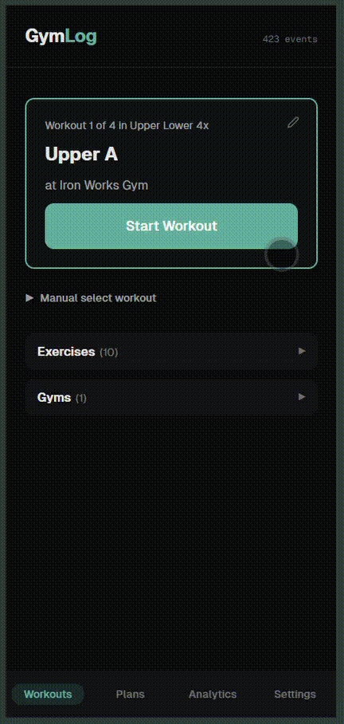
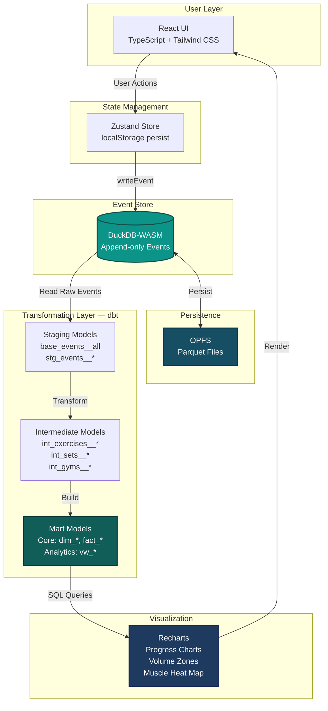
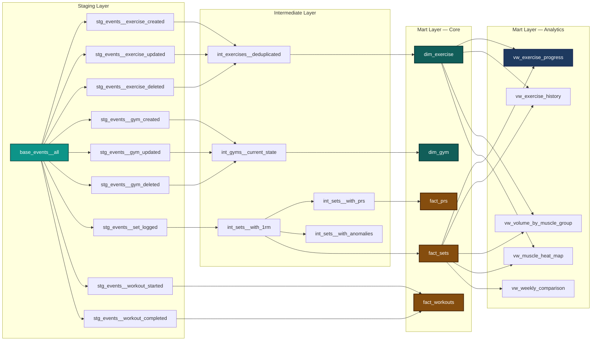

# GymLog

**Event-sourced workout tracking powered by DuckDB-WASM -- a complete analytical data stack running entirely in the browser.**

[](https://username.github.io/gymlog)
[](https://www.typescriptlang.org/)
[](https://duckdb.org/docs/api/wasm)
[](https://react.dev/)
[](https://tailwindcss.com/)

<!--
TODO: Add hero GIF here
Recommended: animated demo showing workout logging flow + analytics dashboard
Size: 800px wide, optimize with gifski or similar
Place file at: docs/demo.gif
Usage: 
-->

---

## Why This Project

GymLog is not just a workout tracker. It is a complete analytical data stack running entirely in the browser -- no backend, no database servers. Event sourcing, SQL-based transformations via dbt, and OLAP analytics with DuckDB-WASM deliver the same architectural patterns used in production data warehouses, but in a client-side PWA.

This project proves that senior Data Engineering principles -- dimensional modeling, incremental materialization, data quality testing, and lineage tracking -- can be implemented in TypeScript as effectively as in Python/Airflow/Snowflake.

**What makes this a portfolio piece, not just an app:**
- **Event sourcing** with immutable audit trail and replay semantics
- **DuckDB-WASM** running vectorized OLAP queries at analytical speed in the browser
- **dbt** for SQL transformations with lineage tracking and data quality tests
- **Kimball dimensional modeling** (star schema with fact/dimension tables)
- **OPFS persistence** using the Origin-Private Filesystem API for Parquet storage
- **30+ dbt models** across staging, intermediate, and mart layers

---

## Key Features

### Workout Tracking
- Workout plans with drag-drop reordering
- Batch set logging with grid UI and ghost text from last session
- Workout rotation with auto-advance and Quick Start
- Post-workout summary with PR highlights and volume totals
- Exercise notes per session, visible in next workout for context
- Auto-calculated warmup hints with configurable tiers (default 50% x 5, 75% x 3)
- Exercise history with gym-context filtering

### Analytics
- Exercise progress charts (weight, estimated 1RM, volume over time)
- Volume analytics per muscle group with research-backed zone thresholds (Schoenfeld et al.)
- Anatomical muscle heat map visualization
- Summary stats with week-over-week trends

### Data Engineering
- Event sourcing with immutable append-only event store
- DuckDB-WASM OLAP engine with OPFS persistence
- dbt SQL transformations (staging, intermediate, marts layers)
- Parquet export/import for data portability

### Portfolio and Demo
- One-click demo data for instant portfolio review (3 months of realistic training)
- TOON export for AI/LLM-optimized data sharing (@toon-format/toon)
- OKLCH-based design system with WCAG AA contrast
- Full CI/CD with GitHub Pages deployment

---

## Architecture



**Data Flow:**
1. User interactions (log set, start workout, create plan) emit events
2. Events are written to DuckDB-WASM event store persisted via OPFS
3. dbt SQL models transform raw events into dimensional models
4. Analytics views aggregate data for visualization
5. Recharts renders progress insights to the UI

---

## Key Data Engineering Decisions

### 1. Event Sourcing over CRUD
**Why:** Immutable audit trail preserves complete workout history. Every weight change, PR, and workout is traceable. Enables time-travel queries and replay scenarios.

**Tradeoffs:** More complex query patterns (event deduplication, state reconstruction). Higher storage overhead (offset by browser compression). No direct updates -- append-only architecture.

**Portfolio Value:** Demonstrates understanding of event-driven architectures and CAP theorem tradeoffs.

---

### 2. DuckDB-WASM for In-Browser OLAP
**Why:** 10-100x faster than JavaScript for analytical queries. Native SQL support. Vectorized execution engine. OPFS persistence across sessions. Zero backend infrastructure.

**Tradeoffs:** ~9MB WASM bundle (mitigated by CDN caching). Limited to browser APIs (no filesystem access). Requires SharedArrayBuffer (restricts deployment to COI-enabled contexts).

**Portfolio Value:** Shows ability to select cutting-edge tools and navigate low-level technical constraints (OPFS bugs, WASM memory limits).

---

### 3. dbt for SQL Transformations
**Why:** Industry-standard transformation framework. Built-in testing (unique, not_null, relationships). Automatic lineage tracking. Dimensional modeling patterns (Kimball methodology). Separates data logic from presentation.

**Tradeoffs:** Build-time only (no incremental materialization in browser). Python dependency for CI/CD. SQL string interpolation required (DuckDB-WASM doesn't support prepared statements).

**Portfolio Value:** Proves fluency in modern data stack tooling and data warehouse design.

---

### 4. OPFS for Persistence
**Why:** Origin-private filesystem offers true file-level persistence. Survives page refreshes and browser restarts. Enables Parquet-based storage (columnar compression). No quota prompts (unlike IndexedDB).

**Tradeoffs:** Chromium-only support (Firefox/Safari lack OPFS). Requires COOP/COEP headers (complicates deployment). Manual file management (no automatic garbage collection).

**Portfolio Value:** Demonstrates expertise in browser storage APIs and willingness to adopt emerging standards.

---

## Data Model and Lineage



**Model Layers:**
- **Staging:** Raw event parsing and type casting from DuckDB event store
- **Intermediate:** Business logic (deduplication, 1RM calculation, PR detection, anomaly flagging)
- **Core Marts:** Dimensional models (Kimball star schema) for general-purpose queries
- **Analytics Marts:** Denormalized views optimized for specific visualizations

**Data Quality:** All models include dbt tests (`unique`, `not_null`, `relationships`) and are validated in CI/CD.

---

## Tech Stack

| Category | Technology | Version | Purpose |
|----------|-----------|---------|---------|
| **Frontend** | React | 19 | UI framework with concurrent rendering |
| **Language** | TypeScript | 5.9 | Type safety and developer experience |
| **Database** | DuckDB-WASM | 1.32.0 | In-browser OLAP engine |
| **Transformations** | dbt-duckdb | Latest | SQL-based ETL framework |
| **State** | Zustand | 5 | Lightweight state management |
| **Storage** | OPFS | Native | Origin-private filesystem API |
| **Styling** | Tailwind CSS | 4 | Utility-first CSS with OKLCH design tokens |
| **Charts** | Recharts | 3.7 | Declarative React charting |
| **Animation** | Framer Motion | 12 | Page transitions and micro-interactions |
| **Validation** | Zod | 4 | Runtime schema validation |
| **Anatomy** | react-muscle-highlighter | 1.2 | SVG muscle group visualization |
| **AI Export** | @toon-format/toon | 2.1 | LLM-optimized data export (TOON format) |
| **Testing (Unit)** | Vitest | 4 | Fast test runner with happy-dom |
| **Testing (E2E)** | Playwright | 1.58 | Browser automation (Chromium) |
| **Build** | Vite | 5.4 | Fast bundler with HMR |
| **CI/CD** | GitHub Actions | -- | Lint, test, dbt compile, deploy |

---

## Getting Started

**Prerequisites:** Node.js 18+ and npm

```bash
# Clone the repository
git clone https://github.com/username/gymlog.git
cd gymlog

# Install dependencies
npm install

# Start development server
npm run dev
```

Visit `http://localhost:5173` and click **"Load Demo Data"** in Settings to populate 3 months of realistic workout history with exercises, plans, PRs, and analytics data.

**Browser Requirements:**
- Requires a Chromium-based browser (Chrome, Edge, Brave) for SharedArrayBuffer and OPFS support
- Firefox and Safari are not supported due to missing OPFS APIs
- First load downloads DuckDB-WASM (~9MB) and initializes the OPFS database

---

## Running Tests

```bash
# Unit tests (Vitest)
npm run test

# E2E tests (Playwright -- requires Chromium)
npx playwright install chromium
npm run test:e2e

# dbt model validation
cd dbt && pip install -r requirements.txt && dbt compile --target browser
```

---

## Project Structure

```
gymlog/
+-- src/
|   +-- components/          # React components
|   |   +-- analytics/       # Charts, volume zones, heat maps, summary stats
|   |   +-- backup/          # Parquet export/import
|   |   +-- history/         # Exercise history views
|   |   +-- plans/           # Workout plan builder with drag-drop
|   |   +-- rotation/        # Workout rotation management
|   |   +-- settings/        # Demo data, TOON export, warmup config
|   |   +-- ui/              # Design system primitives
|   |   +-- workout/         # Active workout logging, notes, warmup hints
|   +-- db/                  # DuckDB-WASM client and queries
|   +-- hooks/               # Custom React hooks (data fetching)
|   +-- services/            # Business logic services
|   +-- stores/              # Zustand state management
|   +-- styles/              # OKLCH design tokens and globals
|   +-- types/               # TypeScript type definitions
|   +-- utils/               # Shared utilities
+-- dbt/
|   +-- models/
|   |   +-- staging/         # Raw event parsing (stg_events__*)
|   |   +-- intermediate/    # Business logic (int_*__*)
|   |   +-- marts/           # Dimensional + analytics (dim_*, fact_*, vw_*)
|   +-- tests/               # dbt data quality tests
|   +-- macros/              # dbt SQL macros
+-- src/e2e/                 # Playwright E2E test specs
+-- src/tests/               # Vitest unit + integration tests
+-- public/                  # Static assets (COI service worker)
+-- .github/workflows/       # CI/CD pipeline (ci.yml)
```

---

## CI/CD Pipeline

```
Jobs (parallel):
  1. lint        -> ESLint + TypeScript type checking
  2. test-unit   -> Vitest unit tests
  3. test-e2e    -> Playwright E2E tests (Chromium)
  4. dbt-check   -> dbt compile (validates SQL + DAG integrity)

Deploy (after all pass):
  5. build-deploy -> Vite build + GitHub Pages publish with COI headers
```

**Pipeline Features:**
- Parallel job execution (4 checks + 1 deploy)
- dbt SQL validation ensures query correctness before deploy
- E2E tests verify critical user flows (workout logging, PR detection, demo data)
- Automated deployment to GitHub Pages with COOP/COEP headers for SharedArrayBuffer

---

## Performance

- **Lazy-loaded Analytics:** Recharts (~110KB) stays out of the main bundle via React.lazy
- **Code splitting:** Analytics page and heavy components loaded on demand
- **DuckDB CDN caching:** ~9MB WASM binary cached after first load
- **OLAP speed:** Analytical queries run 10-100x faster than equivalent JavaScript

See [PERFORMANCE.md](./PERFORMANCE.md) for bundle analysis and Lighthouse scores.

---

## License

MIT

---

*v1.5 -- Event-driven architecture / Dimensional modeling / Browser-native OLAP / SQL transformation pipelines / Type-safe frontend engineering*
