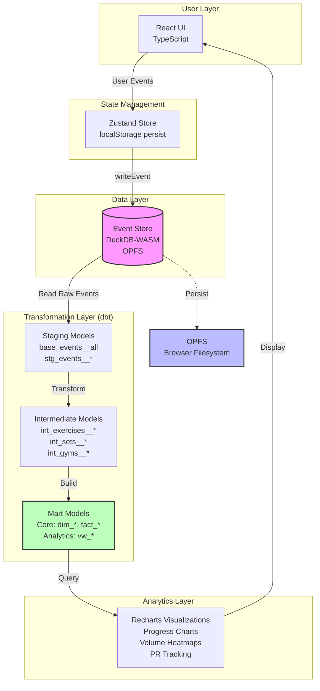
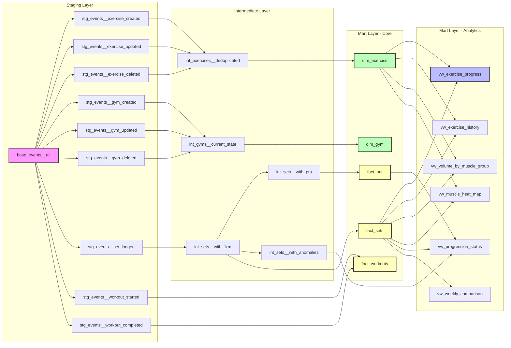

# GymLog - Event-Sourced Workout Tracker

**A browser-native analytical data platform showcasing modern data engineering patterns in the frontend**

[](https://username.github.io/gymlog)
[](https://github.com/username/gymlog/actions)
[](https://www.typescriptlang.org/)
[](https://duckdb.org/docs/api/wasm)

---

## Why This Project

GymLog demonstrates a complete analytical data stack running entirely in the browser—no backend, no database servers. Event sourcing, SQL-based transformations via dbt, and OLAP analytics with DuckDB-WASM deliver the same architectural patterns used in production data warehouses, but in a client-side PWA. This project proves that senior Data Engineering principles (dimensional modeling, incremental materialization, data quality testing) can be implemented in TypeScript as effectively as in Python/Airflow/Snowflake.

---

## Architecture



**Data Flow:**
1. User interactions (log set, start workout, create template) emit events
2. Events are written to DuckDB-WASM event store in OPFS
3. dbt SQL models transform raw events into dimensional models
4. Analytics views aggregate data for visualization
5. Recharts renders progressive overload insights

---

## Key Data Engineering Decisions

### 1. Event Sourcing over CRUD
**Why:** Immutable audit trail preserves complete workout history. Every weight change, PR, and workout is traceable. Enables time-travel queries and replay scenarios.

**Tradeoffs:** More complex query patterns (event deduplication, state reconstruction). Higher storage overhead (offset by browser compression). No direct updates—append-only architecture.

**Portfolio Value:** Demonstrates understanding of event-driven architectures and CAP theorem tradeoffs.

---

### 2. DuckDB-WASM for In-Browser OLAP
**Why:** 10-100x faster than JavaScript for analytical queries. Native SQL support. Vectorized execution engine. OPFS persistence across sessions. Zero backend infrastructure.

**Tradeoffs:** 9MB WASM bundle (mitigated by CDN caching). Limited to browser APIs (no filesystem access). Requires SharedArrayBuffer (restricts deployment to COI-enabled contexts).

**Portfolio Value:** Shows ability to select cutting-edge tools and navigate low-level technical constraints (OPFS bugs, WASM memory limits).

---

### 3. dbt for SQL Transformations
**Why:** Industry-standard transformation framework. Built-in testing (unique, not_null, relationships). Automatic lineage tracking. Dimensional modeling patterns (Kimball methodology). Separates data logic from presentation.

**Tradeoffs:** Build-time only (no incremental materialization in browser). Python dependency for CI/CD. SQL string interpolation required (DuckDB-WASM doesn't support prepared statements).

**Portfolio Value:** Proves fluency in modern data stack tooling and data warehouse design.

---

### 4. OPFS for Persistence
**Why:** Origin-private filesystem offers true file-level persistence. Survives page refreshes and browser restarts. Enables Parquet-based storage (columnar compression). No quota prompts (unlike IndexedDB).

**Tradeoffs:** Chromium-only support (Firefox/Safari lack OPFS). Requires COOP/COEP headers (complicates deployment). Manual file management (no automatic garbage collection).

**Portfolio Value:** Demonstrates expertise in browser storage APIs and willingness to adopt emerging standards.

---

## Data Model & Lineage



**Model Layers:**
- **Staging:** Raw event parsing and type casting from DuckDB event store
- **Intermediate:** Business logic (deduplication, 1RM calculation, PR detection, anomaly flagging)
- **Core Marts:** Dimensional models (Kimball star schema) for general-purpose queries
- **Analytics Marts:** Denormalized views optimized for specific visualizations

**Data Quality:** All models include dbt tests (`unique`, `not_null`, `relationships`) and are validated in CI/CD.

---

## Tech Stack

| Category | Technology | Version | Purpose |
|----------|-----------|---------|---------|
| **Frontend** | React | 19 | UI framework with concurrent rendering |
| **Language** | TypeScript | 5.x | Type safety and developer experience |
| **Database** | DuckDB-WASM | 1.32.0 | In-browser OLAP engine |
| **Transformations** | dbt-duckdb | Latest | SQL-based ETL framework |
| **State** | Zustand | 5.x | Lightweight state management |
| **Storage** | OPFS | Native | Origin-private filesystem API |
| **Styling** | Tailwind CSS | 4 | Utility-first CSS with OKLCH colors |
| **Charts** | Recharts | 3.7.0 | Declarative React charting |
| **Testing (Unit)** | Vitest | Latest | Fast test runner with happy-dom |
| **Testing (E2E)** | Playwright | Latest | Browser automation for integration tests |
| **Build** | Vite | 6.x | Fast bundler with HMR |

---

## CI/CD Pipeline

```yaml
# .github/workflows/deploy.yml
Jobs:
  1. lint        → ESLint + TypeScript type checking
  2. test-unit   → Vitest unit tests (71 tests)
  3. test-e2e    → Playwright E2E tests (Chromium)
  4. dbt-check   → dbt compile (validates SQL + DAG)
  5. deploy      → Build + GitHub Pages publish
```

**Pipeline Features:**
- Parallel job execution (4 checks + 1 deploy)
- dbt SQL validation ensures query correctness
- E2E tests verify critical user flows (workout logging, PR detection)
- Automated deployment to GitHub Pages with COI headers

---

## Getting Started

```bash
# Install dependencies
npm install

# Start development server
npm run dev
```

Visit `http://localhost:5173` and click **"Load Demo Data"** to populate:
- 3 months of workout history
- 6 exercises with realistic progression
- Multiple gyms and templates
- PRs and plateau detection data

**Note:** First load downloads DuckDB-WASM (9MB) and initializes OPFS database.

---

## Running Tests

```bash
# Unit tests (Vitest)
npm run test

# E2E tests (Playwright)
npm run test:e2e

# dbt tests (SQL validation)
cd dbt && dbt test
```

---

## Project Structure

```
gymlog/
├── src/
│   ├── components/       # React components
│   │   ├── ui/          # Design system primitives
│   │   └── templates/   # Feature components
│   ├── hooks/           # Custom React hooks
│   ├── stores/          # Zustand state management
│   ├── lib/             # DuckDB client + utilities
│   └── pages/           # Route components
├── dbt/
│   ├── models/
│   │   ├── staging/     # Raw event parsing
│   │   ├── intermediate/# Business logic
│   │   └── marts/       # Dimensional + analytics models
│   └── tests/           # dbt data quality tests
├── tests/
│   ├── unit/            # Vitest unit tests
│   ├── integration/     # Component integration tests
│   └── e2e/             # Playwright E2E tests
└── .github/workflows/   # CI/CD automation
```

---

## License

MIT

---

**Built to demonstrate:** Event-driven architecture • Dimensional modeling • Browser-native OLAP • SQL transformation pipelines • Type-safe frontend engineering
